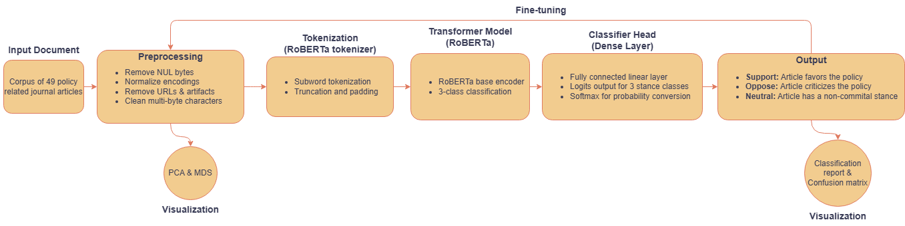
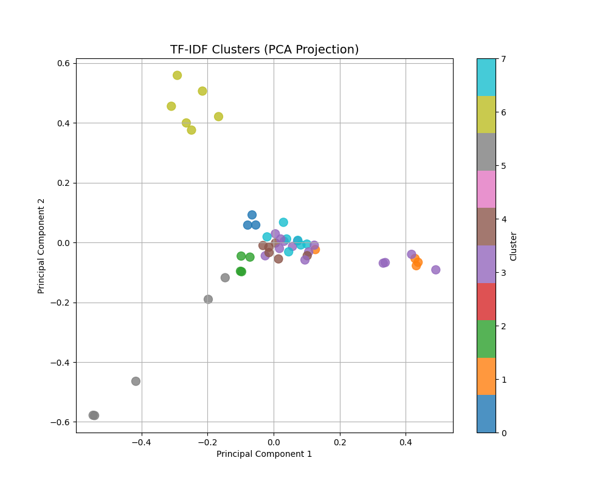
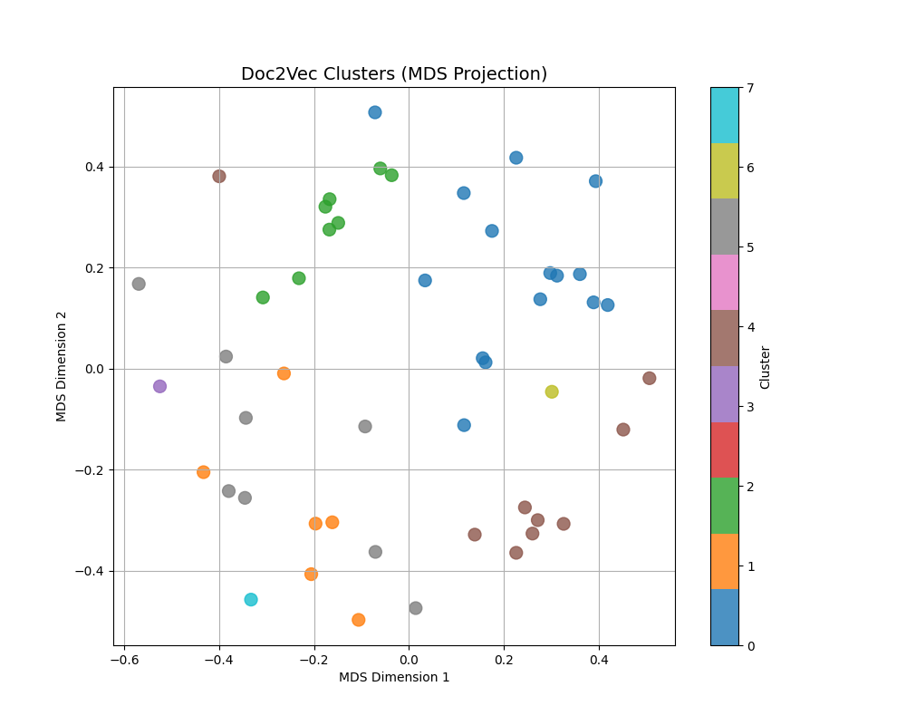
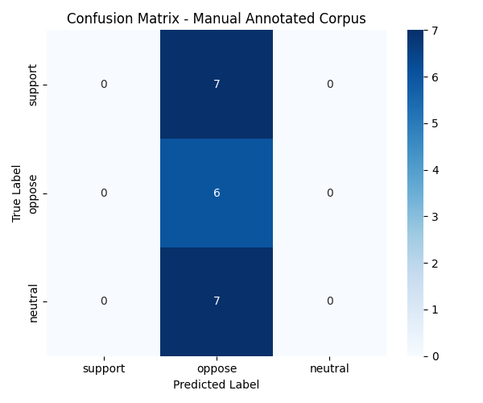
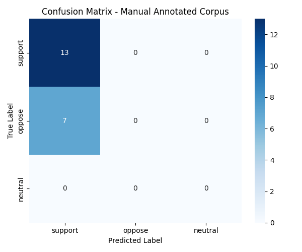

# Stance Detection in Policy Documents using NLP and LLMs

This project explores the use of natural language processing (NLP) and transformer-based models to detect stance—support, oppose, or neutral—in policy-oriented texts. It evaluates both human-annotated and large language model (LLM)-annotated corpora using RoBERTa-based classifiers, with insights into annotation consistency and model performance.

---

## Table of Contents
- [Introduction](#introduction)
- [Corpus](#corpus)
- [Architecture](#architecture)
- [Programming](#programming)
- [Methods](#methods)
- [Results](#results)
- [Discussion](#discussion)
- [Limitations and Future Work](#limitations-and-future-work)

---

## Introduction

Understanding stance in political or policy-related texts provides critical insight into bias, framing, and persuasion. This project aims to detect stance across documents using supervised learning and zero-shot LLM annotation pipelines. The focus is on comparing annotation sources and analyzing the reliability and generalizability of resulting models.

---

## Corpus

The dataset consists of 49 long-form policy-related articles manually contributed by independent researchers. Each document was manually annotated for stance and later re-annotated using the `facebook/bart-large-mnli` zero-shot model. Manual annotations served as a ground-truth baseline for comparison.

---

## Architecture

The NLP pipeline involves:

- Text normalization and cleanup (e.g., removing URLs, decoding special characters)
- Tokenization using `roberta-base` tokenizer
- Training a RoBERTa-based sequence classification model
- Evaluation through classification metrics and confusion matrices

Additionally, unsupervised clustering (TF-IDF + PCA, Doc2Vec + MDS) was used to explore topic groupings and stance separability.

---

## Programming

This project was implemented in Python with the following libraries:

- `pandas`, `numpy`, `sklearn` for data handling and evaluation
- `transformers`, `datasets` for model training
- `matplotlib`, `seaborn` for visualization
- `gensim` for Doc2Vec clustering

---

## Methods

1. **Preprocessing**: Custom normalization to clean special characters, remove NUL bytes, and strip embedded URLs from the documents.
2. **Annotation**:
   - Manual stance annotation into three classes: support, oppose, neutral
   - LLM annotation using `facebook/bart-large-mnli` for comparison
3. **Clustering**:
   - TF-IDF vectorization + KMeans + PCA projection
   - Doc2Vec embeddings + MDS projection
4. **Modeling**:
   - Fine-tuning RoBERTa on both annotation types
   - Train-test splits (stratified) with evaluations using classification report and confusion matrices

---

## Results

- **Manual Corpus Model**:
  - Skewed predictions toward "oppose"
  - Moderate accuracy but poor balance across classes

- **LLM-Annotated Model**:
  - Skewed predictions toward "support"
  - Higher accuracy, but poor generalization

- **Annotation Agreement**:
  - Cohen's Kappa: 0.121 between LLM and human labels
  - Confirms limited alignment in stance perception

  
*Figure: PCA projection of TF-IDF-based clusters.*

  
*Figure: MDS projection of Doc2Vec-based clusters.*

  
*Figure: Confusion matrix for model trained on the full manually labeled corpus.*

  
*Figure: Confusion matrix for model trained on LLM-annotated corpus.*

---

## Discussion

These results indicate significant challenges in stance detection from policy texts. The models exhibit bias based on the distribution and subjective interpretations in annotation. While LLM annotation is faster, it introduces risks due to its tendency to infer implicit stance inconsistently. The manually annotated corpus enabled more interpretable performance comparisons.

---

## Limitations and Future Work

- **Corpus Size**: 49 documents are insufficient for reliable deep model generalization.
- **Annotation Subjectivity**: Human and LLM interpretations diverge, requiring validation workflows.
- **Imbalanced Predictions**: Further work is needed to correct class bias, possibly with augmentation or argument mining.

### Next Steps

- Use hybrid annotation (LLM + human validation)
- Integrate argument structure mining
- Expand corpus and explore semi-supervised learning